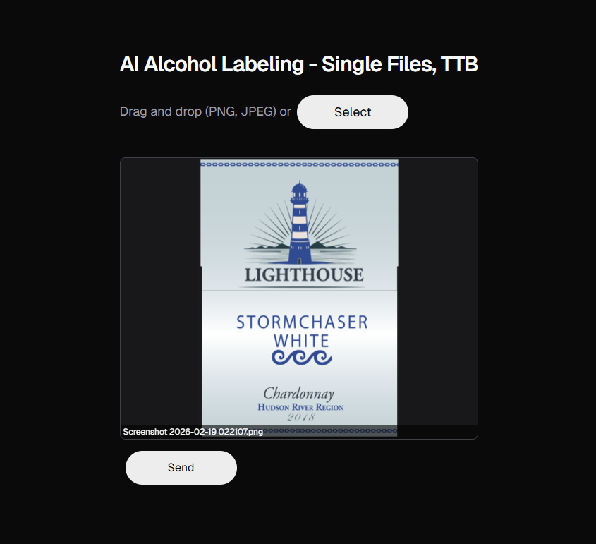
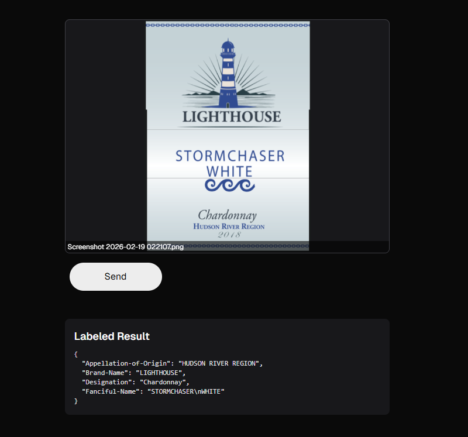

# TTB Labeling Demo

[Live Demo](https://ttb-labeling.pages.dev/)

We built a simple drag and drop interface for uploading label images. Once the images are uploaded, we use Google Cloud's Document AI to extract text and entities from the labels. The results are displayed in a structured format on the frontend.

## Getting Started
> The AI model I'm using can be a little slow since it's designed for batch processing, so please be patient while it processes the images.

1. Download the dataset for images to play around with [dataset](https://storage.googleapis.com/ttb-labeling/small_dataset.zip)
2. Go to [Live Demo](https://ttb-labeling.pages.dev/) and upload the images. You can upload them one by one or in batches.
3. Wait a few seconds for the results to appear. The extracted information will be displayed.

### Learn more about the project

[Tech Specs](./brief.md)

