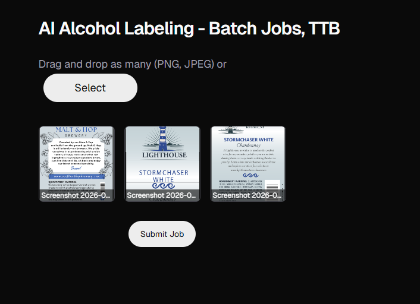
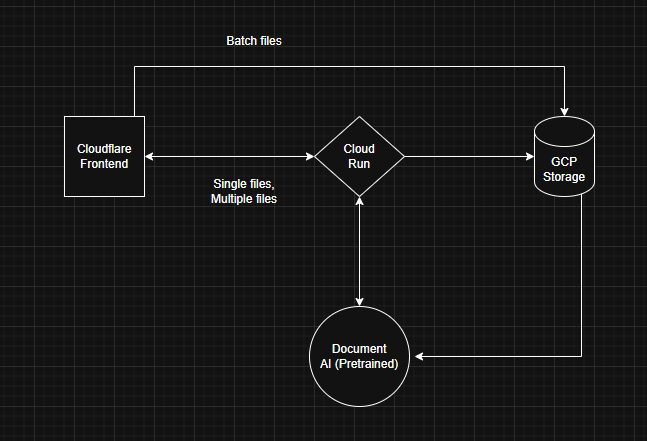

Our demo shows a drag and drop interface for uploading images.

In a few seconds it should give the labels in a structured format.

## Tech Specs

- Cloudflare Frontend - Basic security detection, CDN, caching, DDoS protection...all built in.
- GCP Cloud Run backend - FastAPI app handles file uploads
- GCP Storage - Uploaded to publick bucket
- GCP Document AI - Extracts text and entities from the label images
	- Pre-trained model for driver licenses. Should work well for labels since they have a similar format.
	- Avoids the need to train and maintain our own custom OCR/NER models.

Using fastapi for simplicity. 
- I don't want to worry about scaling, and I want to be able to deploy quickly.
- I want simple. I want maintainable.
- Integrates well with python based AI services

Document AI vs Azure AI document intelligence
- It appears document AI solves exactly our issue. Companies use these for processing company documents.
- Combines multiple technologies (OCR, LLM, CV...) I can't reinvent the wheel here.

### Some thoughts

Why not n8n automations
- Less control and these automations are wooden blocks, we want more fine-grained lego bricks.

For single files this is rather slow since this pipeline was designed for batch processing. I feel like this is a rather decent tradeoff for using such a powerful pre-trained tool.

I'm aware of some of cybersecurity issues. Not production code. But since we aren't handling sensitive data or large quantities at data it serves as a decent prototype.

## Some limitations
- Slow. Since Document AI is designed for batch processing and its internal pipeline combines many different technologies to make an inference, I have no way of speeding this process up. It can take a few seconds per image which is not ideal. However, this is about the order of time for something like pdf parsing or other document processing tools on the internet.
- Large batch loads is a different pipeline entirely. I would ideally bypass the REST api entirely.
- The model we used needs more training data which I don't have. From a eye's view, the results are pretty good but sometimes the confidence score seems a little too high.
- Security. In the interest of time, I have bypassed many security concerns. CORS, authentication, ACLs for the storage bucket, etc. I'm aware of them.
- Prototype. This is not production code. 

Common mistakes 
- 13.5% But TTB wants 13.5% Alc/Vol
- Forgot city + state for producer/bottler
- Government warning altered “just a little”

Common mistakes I can't check for:
- Front/back label confusion. Some imformation must appear together and not scattered. (NOT in the specs)
- Fonts too small
- Sulfites not declared (for wine). Must say Contains Sulfites if more than or equal to 10 ppm.
- Class/type doesn’t match the product (calling it wine when it’s malt-based)
- Imported products missing country of origin
- Brand name implies something illegal 
	- Gluten Free beer - must do paper work to prove it’s gluten free
	- Sugar-free wine - must do paper work to prove it’s sugar free

